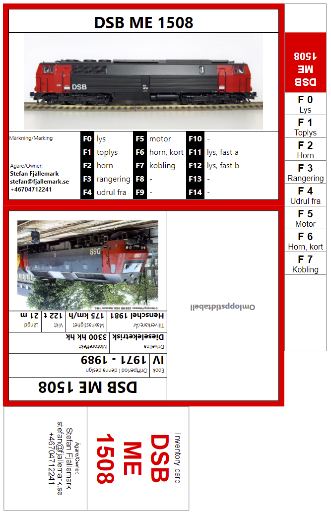

# Wagon Card App
This app helps the *module model railwayer* to 
create loco cards and print them. Maybe printing of wagon cards will mbe added later. 

The app supports English, German, Danish and Swedish. 

.

